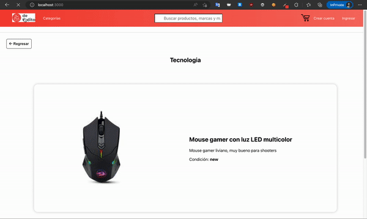

# Proyecto para el curso de React en CoderHouse

Este proyecto simula una tienda online básica. Fue desarrollado en el curso de React en CoderHouse.

# detodito
El proyecto de tienda online.

## Deploy

[detodito.netlify.app](https://dtodito.netlify.app)

## Descripción
Simulación de una tienda online que cuenta con las siguientes características:

- Los usuarios pueden buscar los productos por categorías o nombre.
- Los usuarios pueden agregar un producto al carrito de compras al hacer click en el botón agregar al carro.
- Los usuarios pueden hacer click en el nombre de un producto para ver más información, además pueden indicar la cantidad de productos que desean agregar al carrito de compras.
- En el carrito de compras los usuarios pueden ver el total de su pedido y también pueden aumentar o disminuir la cantidad de un producto.
- Para realizar un pedido se debe iniciar sesión con el usuario designado para pruebas (oscar@dtdt.com, dt012).

## Librerías

- `Create React App` - Iniciar el proyecto
- `React Router` - Navegación
- `Firebase` - Almacenamiento con Firestore

## Scripts

- `npm start`
    Iniciar el proyecto en el entorno de desarrollo.
- `npm build`
    Construir el proyecto para producción.
- `npm test`
    Iniciar el proyecto y ejecutar las pruebas.

## Pre-requisitos

- [Visual Studio Code](https://code.visualstudio.com/) o el editor de texto de tu preferencia.
- [Node.js](https://nodejs.org) la versión LTS de preferencia.
- `usuario:` (oscar@dtdt.com, dt012) 

## Estructura del proyecto

- `src`: Contains all the source code.
    - `assets`: Contains images and custom fonts. (Product images are stored in Firebase Storage)
    - `components`: Componentes de la aplicación.
    - `context`: React context providers.
    - `pages`: Componentes de las vistas que se muestran.
    - `services`: Contienen los servicios con Firestore.
    - `utils`: Funciones de ayuda. 
- `App.js`: Componente principal.

## Final Words
Fue un curso muy interesante y de mucha ayuda para iniciar en React :)